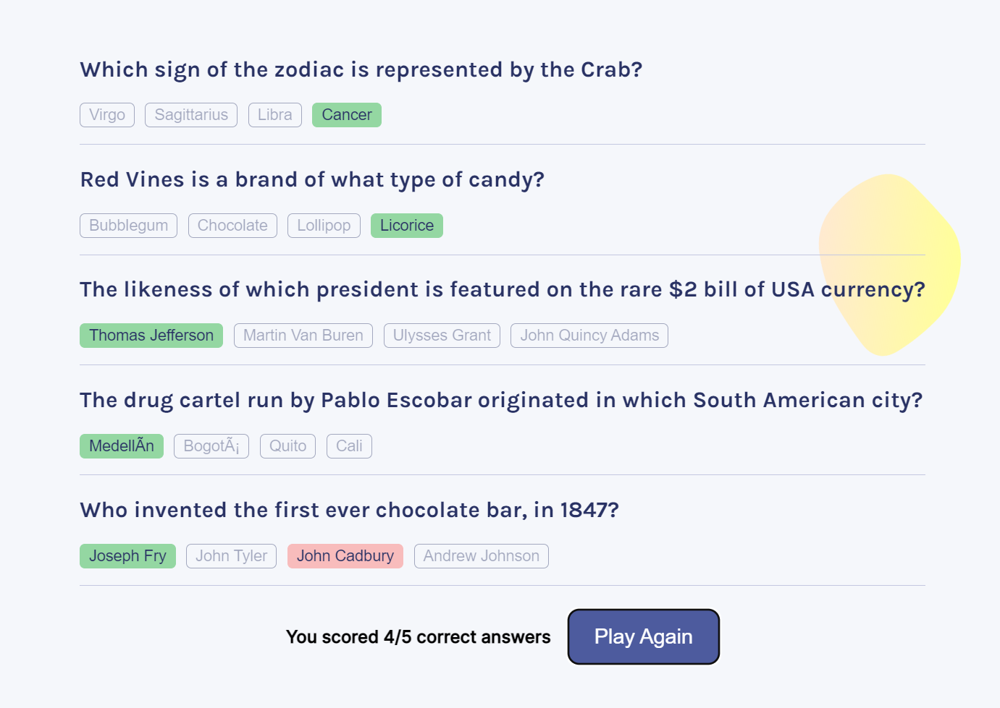

# Quizzical
---

## **Description:**

### Technologies used:

- React 
- JSX
- JavaScript
- HTML | CSS

### Concepts in the project:

- Web development
- React
- Components web development
- Dynamic website
- Mapping
- Props
- Hooks
- Effect | State
- API

### About this project

This is my react project. This project is to create a dynamic website for a quiz game using openTrivia API. And used my knowledge about react, effect, state, API fetch and jsx to assemble components to make this project.
This is a Fun trivia quiz game. That generates 5 random question category of (General knowledge).